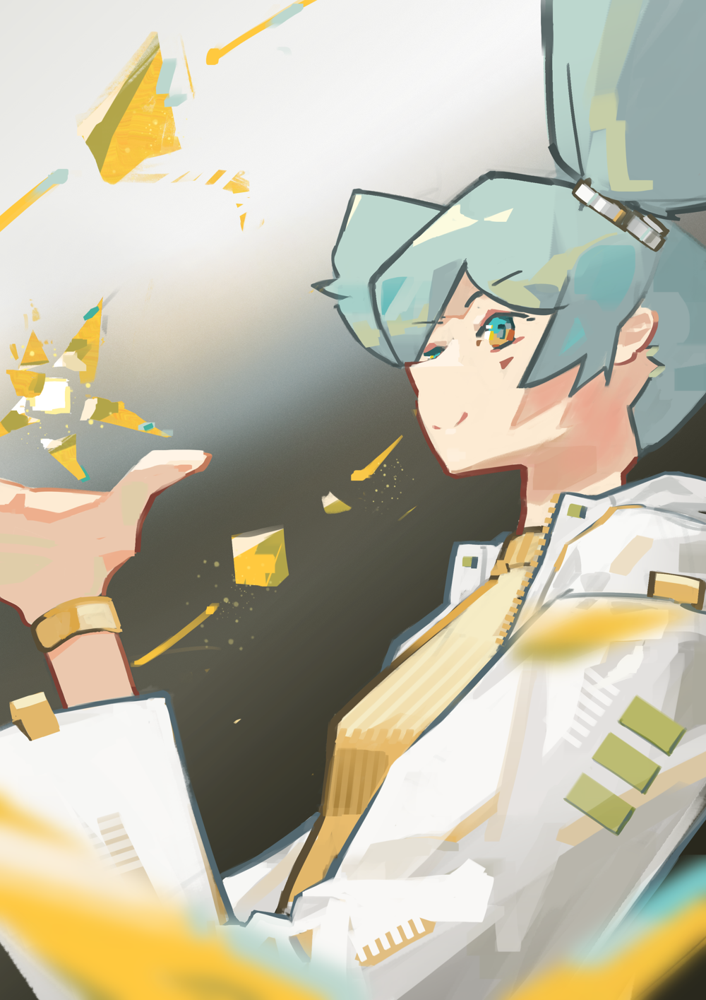
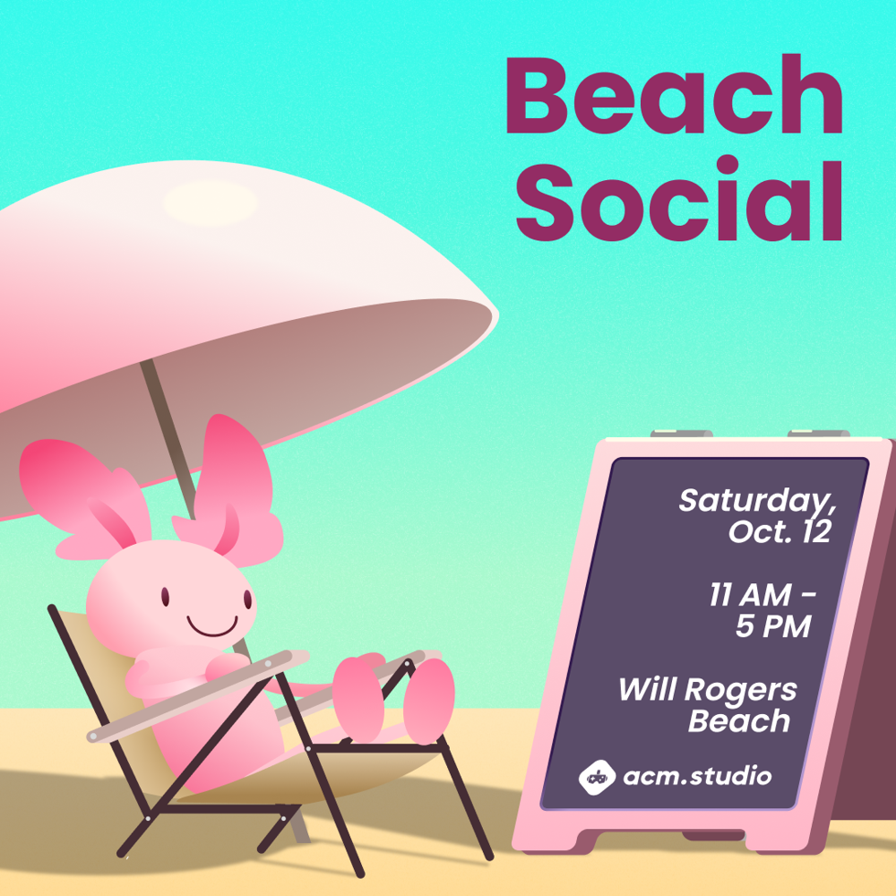
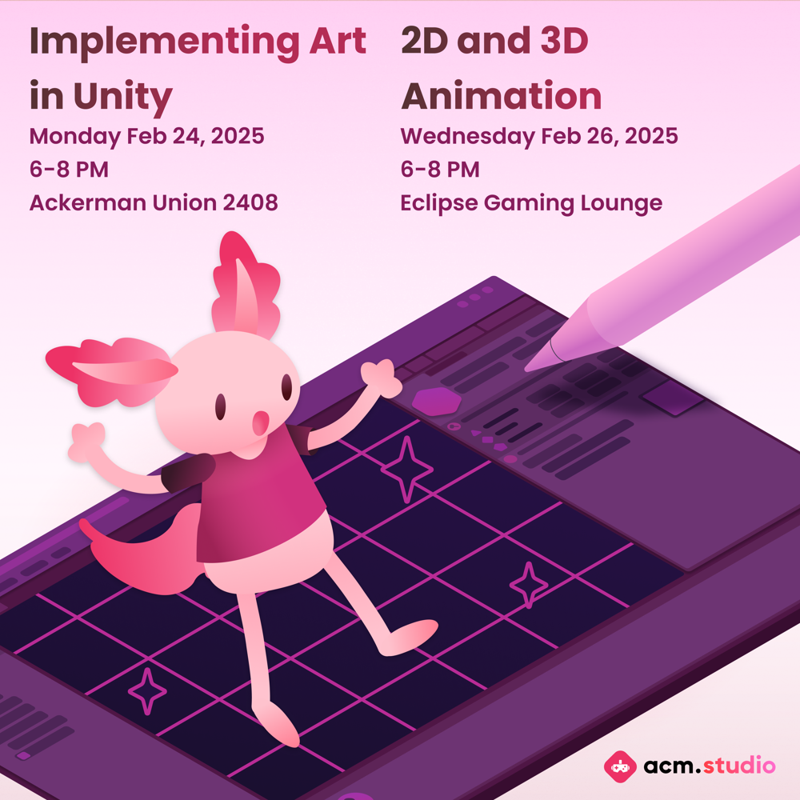
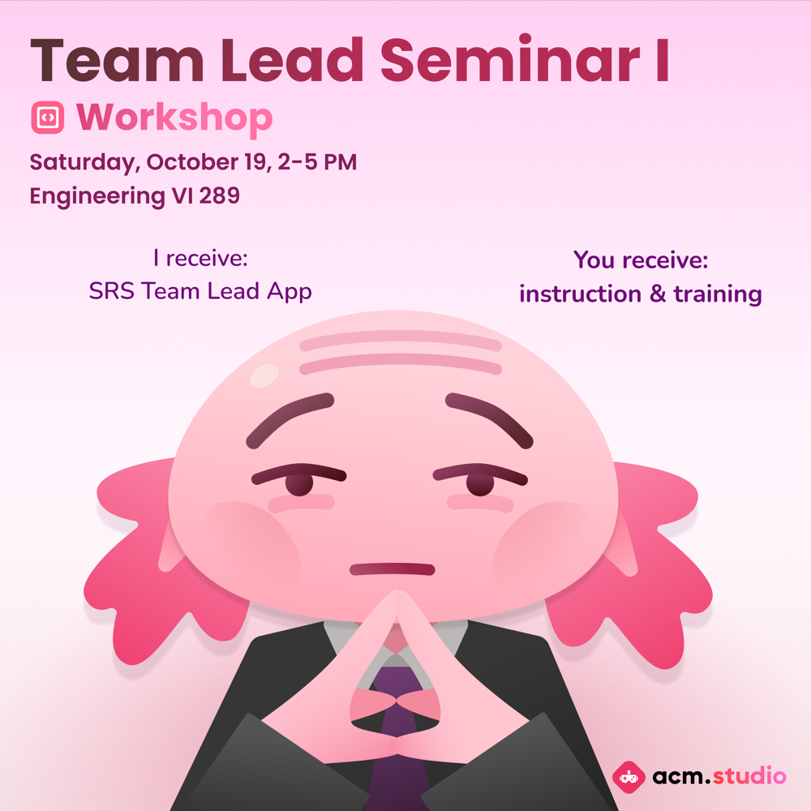
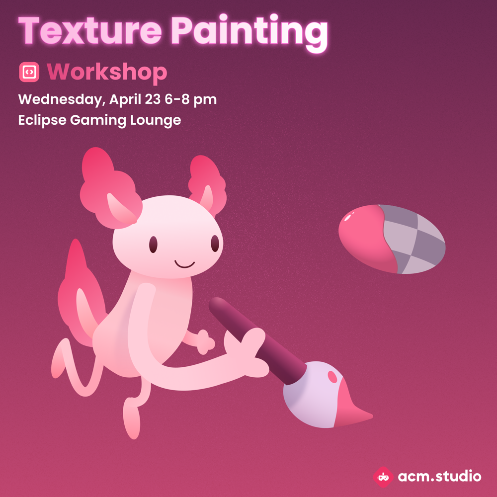

# Art

---

I do manual artist & graphic design for fun. I mostly use Krita and Figma, but
I've been learning Darktable and Inkscape!

{width=100%}

<!--- Remark: using a table to center is cursed --->

{width=100%}

{width=100%}

---

[
{width=40%}
{width=40%}
]{.acm-graphics}
[
{width=40%}
{width=40%}
]{.acm-graphics}

Some graphics I've worked on for ACM Studio, a gamedev club at UCLA. These were
posted to the instagram to promote workshops, socials, and other events, and
feature Sooper, our axolotl mascot.
I learned a lot about Figma and vector design!
